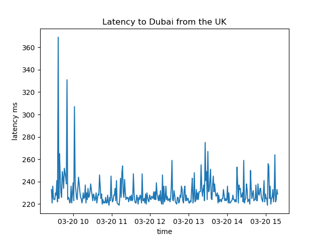

# LatencyTracker
pings IP addresses and tracks latency of request over time

In development ❗ This is not user ready ❗

## features

- [X] ping an arbitrary IP

- [ ] monitor a list of IPs

- [ ] save and load results to/from json file

- [ ] plot results

- [ ] optimise storage of results (don't store similar results)
